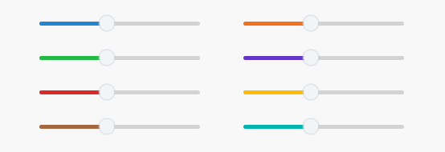

# neo-react-semantic-ui-range

[](https://github.com/jware-solutions/neo-react-semantic-ui-range/actions/workflows/storybook.yml)

A modern single a multi React Slider to use with [Semantic-UI][semantic-ui] or [Fomantic-UI][fomantic-ui].

**IMPORTANT**: although the library mentions Semantic UI/Fomantic UI. It is not necessary to install this dependency. This library contains the needed styles to fit as well as possible with that framework, but you can use it in any desired environment. 





## Installation

```
npm i neo-react-semantic-ui-range

# Or

yarn add neo-react-semantic-ui-range
```


## Usage

Here are some basic examples, **but you can play with all the parameters in the [official Storybook][storybook]**.

### Single slider

```tsx
// Component
import { SingleRangeSlider } from 'neo-react-semantic-ui-range'

// Styles
import 'neo-react-semantic-ui-range/dist/styles.min.css'

const MySingleSlider = (props) => {
	const [value, setValue] = useState<number>(45.5)

	/**
	 * Handles changes.
	 *
	 * @param newValue - New value.
	 */
	function handleChange (newValue: number) {
		setValue(newValue)
	}

	return <SingleRangeSlider
		value={value}
		defaultMinValue={0}
		defaultMaxValue={100}
		step={0.5}
		color='blue'
		onChange={handleChange}
	/>
}
```


### Multi range slider

```tsx
// Component
import { MultiRangeSlider } from 'neo-react-semantic-ui-range'

// Styles
import 'neo-react-semantic-ui-range/dist/styles.min.css'

const MyMultiRangeSlider = (props) => {
	const [minValue, setMinValue] = useState<number>(30)
  	const [maxValue, setMaxValue] = useState<number>(60)

	/**
	 * Handles changes.
	 *
	 * @param newActualMin - New min value.
	 * @param newActualMax - New max value.
	 */
	function handleChange (newActualMin: number, newActualMax: number) {
		setMinValue(newActualMin)
		setMaxValue(newActualMax)
	}

	return <MultiRangeSlider
		minValue={minValue}
		maxValue={maxValue}
		defaultMinValue={0}
		defaultMaxValue={100}
		margin={1}
		color='green'
		onChange={handleChange}
	/>
}
```


## Features

- 🚀 Written in modern React using hooks and clean 
- ✨ Fully Typescript support
- 📖 A lot of colors and StoryBook


## License

This repository is distributed under the terms of the MIT license.


[semantic-ui]: https://react.semantic-ui.com/
[fomantic-ui]: https://fomantic-ui.com/
[storybook]: https://jware-solutions.github.io/neo-react-semantic-ui-range/